## LuaNT 4.0 Manual!!!

Hello! This is a manual for correctly work with LuaNT

### Why he freeze at BCD: Parsing Boot Configuration Data entries... ?
NOT, he NOT freezing, you just NOT SEE initialization progress, if you need to see this, after **Mm: Allocated memory ....** press **F8** or twice press **F8**, and in BCD menu, enter **2** and you can see Debug Log

### Why he fails at Read-Only disk?
Check, if you NOT INSTALL LuaNT at READ-ONLY disk, or he crash, LuaNT can work with external Read-Only floppies and disks.
WARNING: LuaNT can Write/Read at extrenal **filesystem** devices, by using **ntdll.lua**

### SMS? Now i CAN CHATTING??
NO, bro... is a Systems Management Servers, or simple: App Market, here programs, drivers and other things, that here on GitHub agreed by me(RedstoneShell), you can see list of programs at LuaNT GitHub(SystemsManServer/packages.cfg)

### Wireless HDD's!
From 14.09.2026, you can use program **nfs.lua**(Network FileSystem), install by SMS > Wireless HDD. For start, create server with OpenOS, insert disk with OpenOS, and disk that need to make Wireless, or connect external RAID, he identical. Now install **NetHDD Server**->"pastebin get -f zNjJJFZ3 nethdd_serv.lua", and enter "nethdd_serv". If you start it at first time, he displays HDD's list to select HDD's to make it Wireless, enter number of needed disk and press ENTER. After that server makes this disk Wireless. Now at LuaNT open Start menu > Run..., and enter "**nfs.lua**" and press ENTER. Wait some time and in window click "[SEARCH]", wait some time, and click enter at needed server (TIP: edit nethdd_serv.lua to change server name from "\\\\MYSERVER\\disk" to needed). Now after ENTER, open new windows, by clicking any letter at keyboard, you set letter of Wireless disk, by press "[OK]" you mount wireless disk in system. Now you can open Start menu > File Explorer, and select new disk that named for example: "\\MYSERVER\disk". Now after mounting, every programs and LuaNT see this disk as normal disk in your computer. WARNING!: After reboot, connection to disk RESET, after that you need to repeat all actions to Re-mount Wireless back in LuaNT!

### Relay Control
From 15.09.2026, you can use program **L2ctrl.lua**(Relay Controller), install by SMS > L2Control. For start, place near Relay(https://ocdoc.cil.li/block:switch) and connect to computer with LuaNT, now open Start menu > Run... and enter "L2ctrl" and press ENTER, in menu you can switch Repeater mode, for wireless Relay switch strenght. For **Lossmeter** button, create computer with OpenOS, place **Network Card**, run "pastebin get -f VebVX21x lossmeter.lua" and start "lossmeter". After connect OpenOS computer to Relay by **Cable**, now check if in computer with LuaNT installed **Network Card**, after check click button **Lossmeter**, wait some time, and after that at screen you see % of Loss, transmited/received packets and lossed packets.
Heres menu:
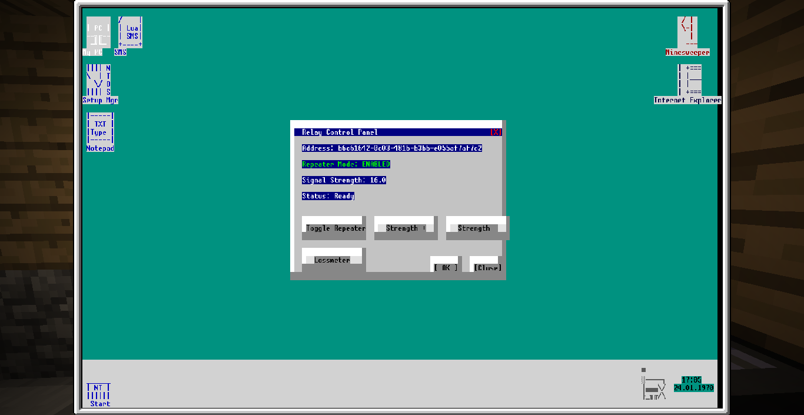

Loss for Relay without anything:
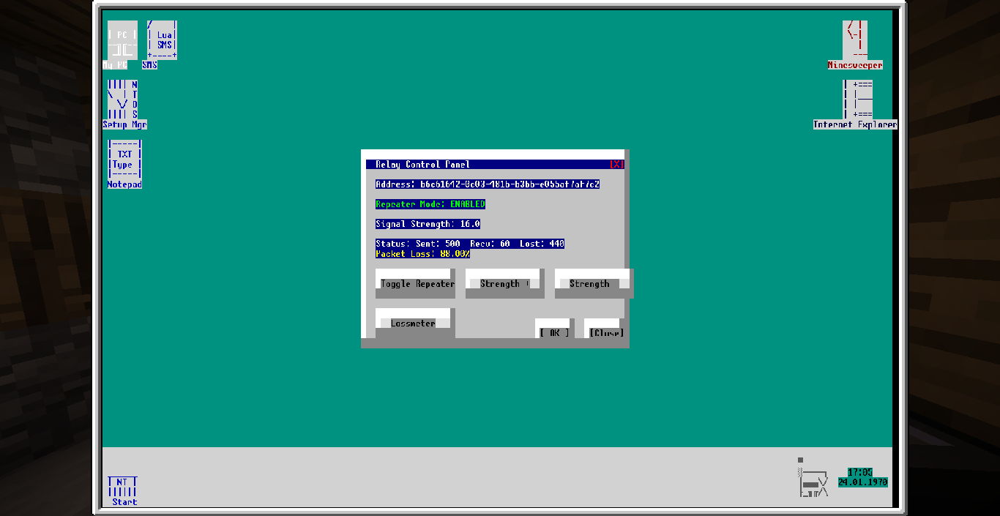

Loss for Relay with Tier 2 CPU only:
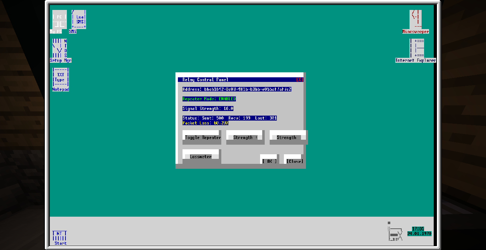

Loss for Relay with Tier 3 CPU only:
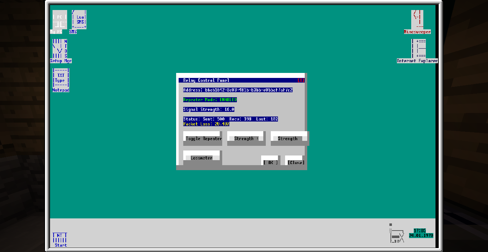

### Why colors at my Tier 1/2 screens soo werid (i don't have Tier 3 screen/videocard)
Yet, LuaNT 4.0 maked only for Tier 3 screens/gpu's, but after 4.0.1.3, you can use Start>Color Setup... and select need color map (Monochrome, 16 colors, 256 colors). After Reboot, color map changed. I don't see this function in other OS, and i think, i made it first in OpenComputer. Idk why, but on Tier 1 screen don't work clicks...
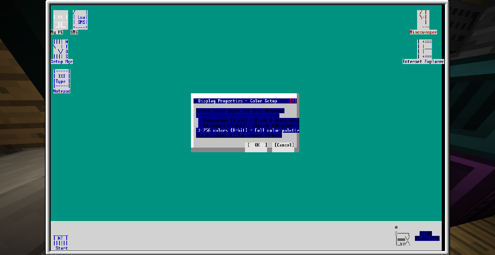

And Tier 1/2/3 screens modes (1bit/4bit/8bit colors):
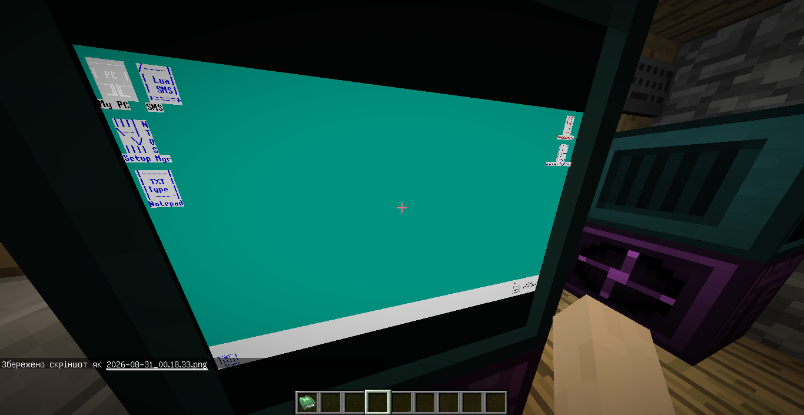
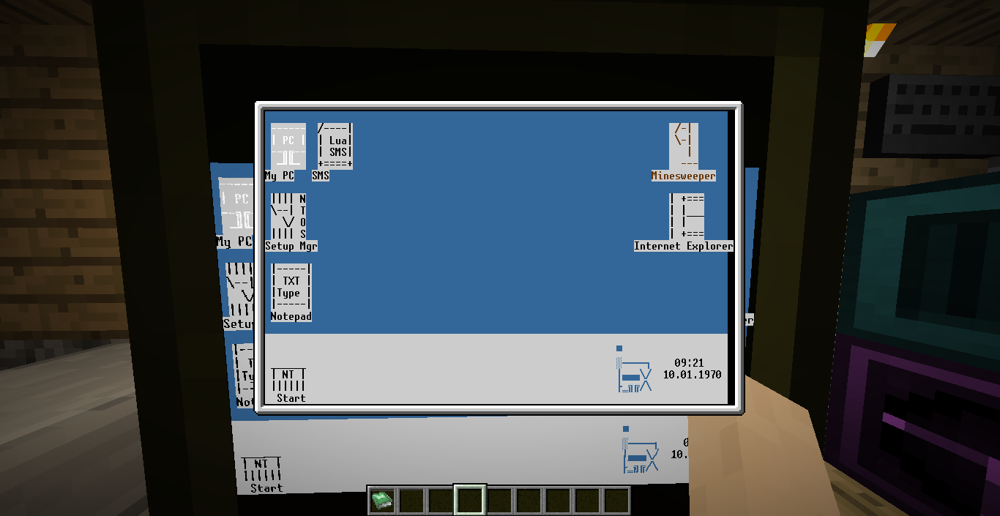
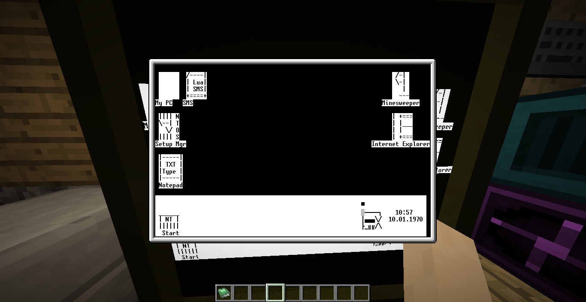

## Server Administrators help

### How to use this OS at my server?
Just install LuaNT 4.0 at your disk, he works normally at PC and Servers. LuaNT is a Server+Normal Edition's in one package.

### What is a DHCP, and how to work with he?
If you see this files in System32 ("**dhcpadmn.lua**", "**dhcpssvc.lua**"), you think about: "What is that?". Here everything about this strange files:
#### DHCP Server Service
If you hate infinity **UUID** Copy+Paste of Computers/Servers/Robots networks, to link it in one Network, we have DHCP. This is a protocol, that gives for you components unquie IP Address from IP Pool (See DHCP Admin), for every IP, server gives timeout, after that, this IP automaticaly releases for next connection.
#### How to start:
  - WARNING!: Server and Client(s) need placed in any slot Network Card(or Wireless) for DHCP work and connection.
  - At own PC/Server open Start menu (left-bottom button click) and click to **Run...**, in opened menu enter "**dhcpssvc.lua**", press ENTER, and wait some time.
  - Now your PC is a DHCP Server, he gives for DHCP_DISCOVER packets IP Addresses in responces.
  - For connect, and receive IP Address, recommended use OpenOS at device to connect, download this script "**pastebin get -f fPDbZZSb dhcp_client.lua**", and start, if you start DHCP Server, after some attempts he find Server and connect.
  - Now you can edit "**dhcp_client**", and add new packets to transmitting from DHCP Server at selected IP. And with your programs, use port 68 for receive packets (this packets make anything that you codded at his detection in **dhcp_client**)

#### DHCP Administrator GUI
Every DHCP Servers needs Control, for this we have "**dhcpadmn.lua**". WARNING!: Before start, check if you start DHCP Server, or Admin GUI start control nothing.
#### How to start:
  - At own PC/Server open Start menu (left-bottom button click, spam clicks, multitask some lag Desktop) and click to **Run...**, in opened menu enter "**dhcpadmn.lua**", press ENTER, and wait some time.
  - After open this GUI, you can switch modes (Read: DHCP Administration Tutorial)
  - If you close Admin GUI, DHCP Server automaticaly stop. I don't have ideas how to stop DHCP Server.

## DHCP Administration Tutorial
Now you can train, how to work with DHCP, lets start:

### First page
At this page, you can see buttons upper, at screenshot you see what he do:
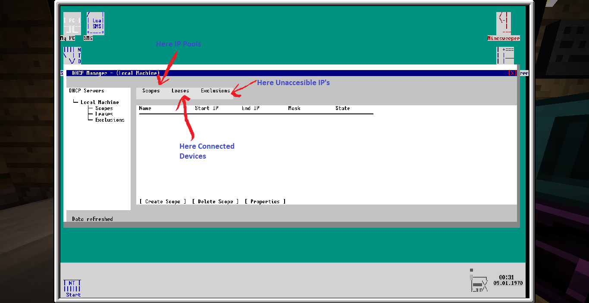

For example, by click at Leases, you can see every connection to this DHCP Server, here description of every parameters:
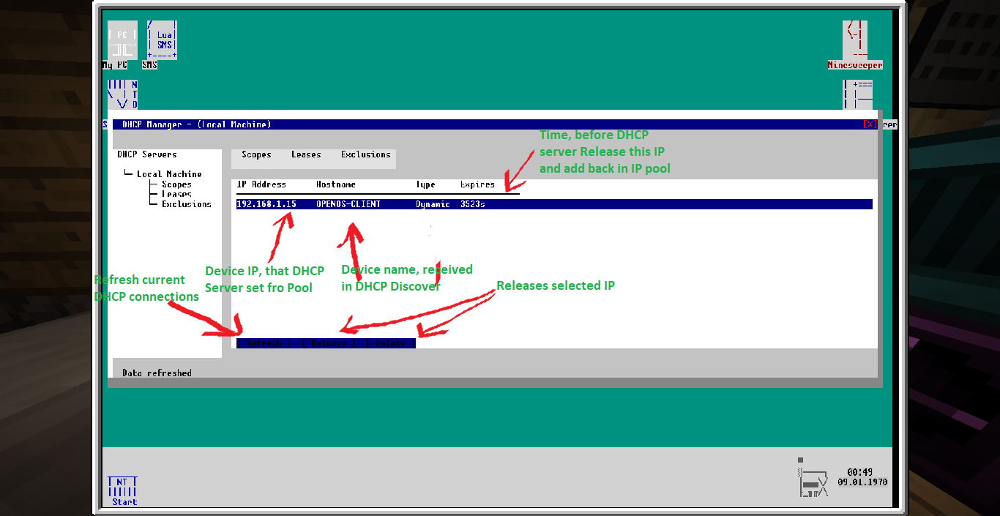

If you need to block some IP's range, use **Exclusions** tab:
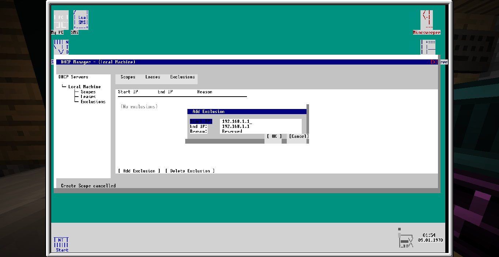
For switch fields, use **Tab** button on keyboard.
Example Exclusion:
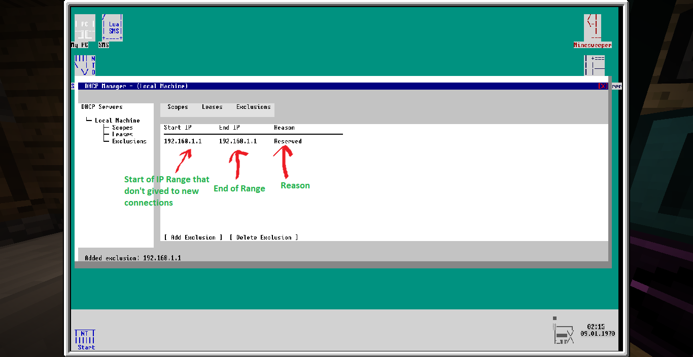

At standard DHCP Server, IP Pool range is automaticaly set to 192.168.1.15..192.168.1.100, you can change it by click to **[ Create Scope ]**
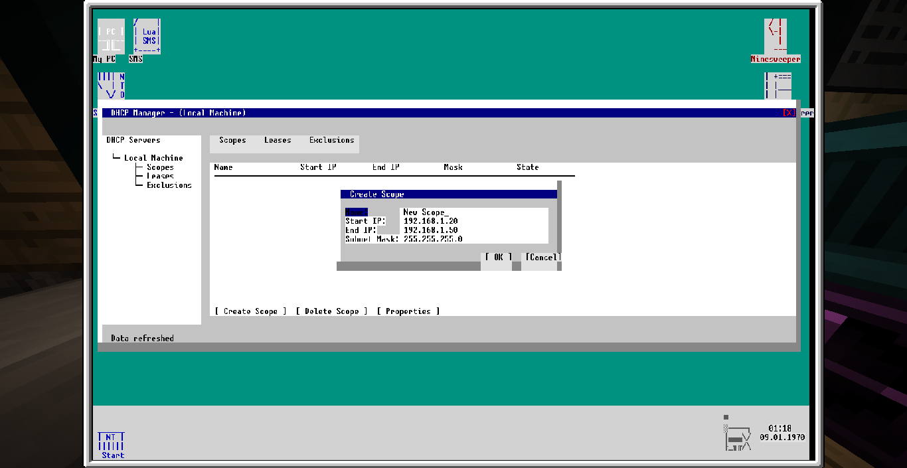

Now, try itself at DHCP Admin, if you lost what to do, open this manual.

## Robocopy
Very good instrument for copying files in folders to other folders. In 4.0.1.3 update, "robocopy" integrated in System.
Everything that you need to do at this scheme:
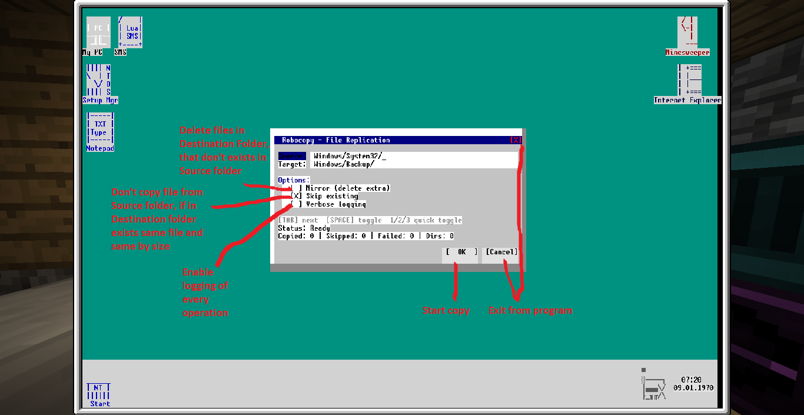

## About "Run..."
Interesting fact! You can enter just, for example "**dhcpadmn.lua**" and this automaticaly start **Windows/System32/dhcpadmn.lua**

This works only if program in this paths:
  - Windows/
  - Windows/System32
  - Program Files/

### END
