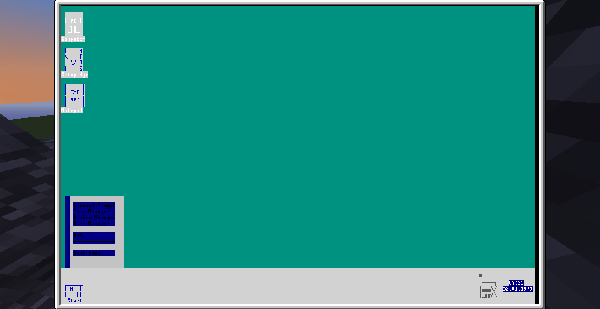
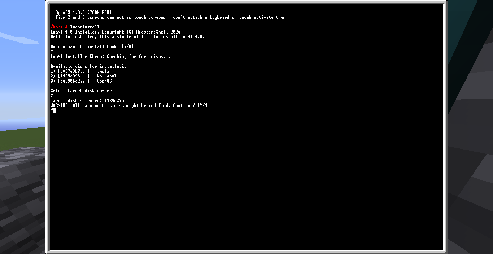
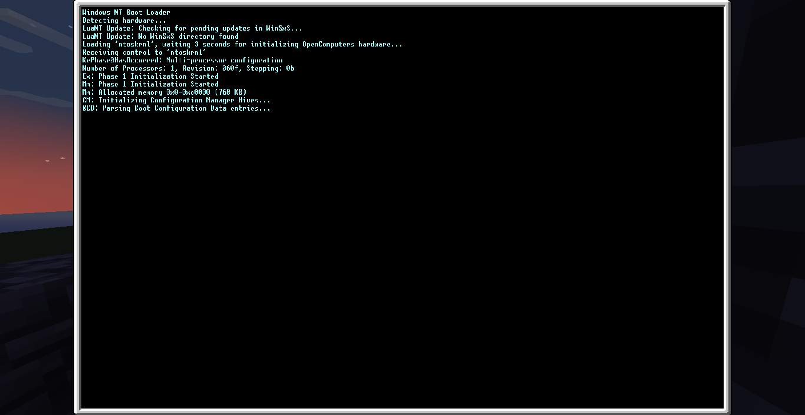
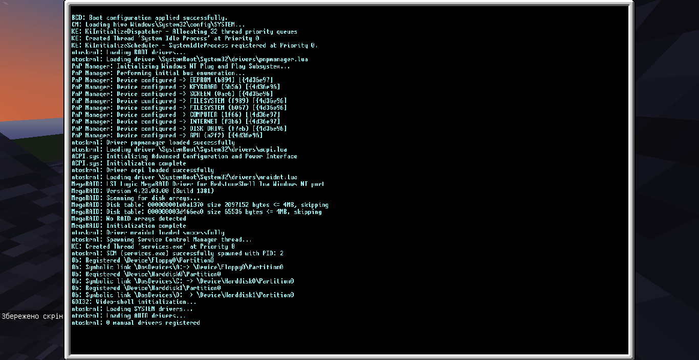
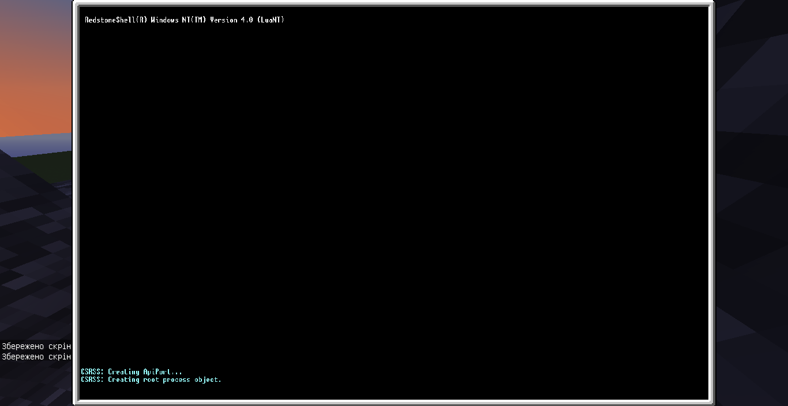
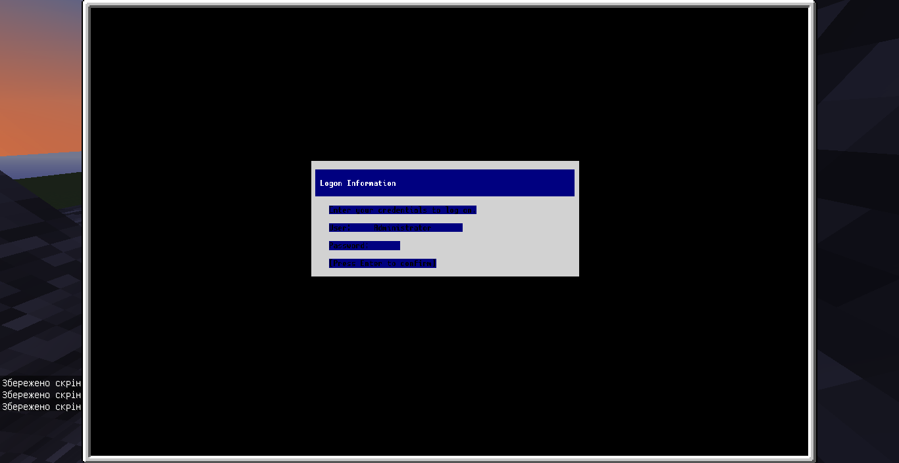
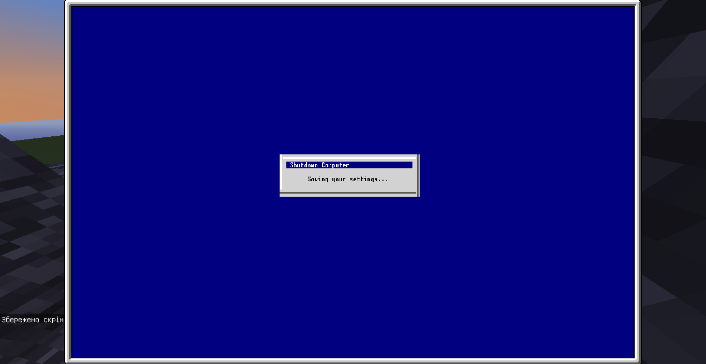

# LuaNT 4.0, A greatest project in OpenComputers (MC 1.12.2) mod, FROM 01.07.2026 integrated with OpenPrinter

A Operating System with simple GUI, Launches at minimum 1x 384KB RAM (Tier 2) free 14KB in max usage; for normal use minimum x2 384KB RAM (Tier 2), gets 768KB, free in maximum 266KB.
Have a Winlogon, drivers, services, Registry, multi-task, Plug-and-Play, WinUpdate (custom system), notepad, Device Manager, Task Manager and Console. From 26.06.2026 we have basic RSA Base with: DES, 3DES, RC2, RC4, MD2, MD4, MD5. 

!!WARNING!!: Unstardard installation created, for making LuaNT run without cover at OpenOS, he have own **init.lua** and **ntoskrnl.lua**, for initializing every system. Second HDD disk to install needed for separate LuaNT from OpenOS!

NOW you can Print and Scan pages of paper with OpenPrinter (https://www.curseforge.com/minecraft/mc-mods/openprinter), if connect, and use Spooler and WinPrint to print, for make own files NO not use VS Code, instead use Notepad at LuaNT desktop for making file, see **Notepad Help**

## How to install this?
First: Create PC with:
   - Standard components
   - Internet card
   - 2 HDD disks (first for OpenOS, second for LuaNT)

Second: Install OpenOS.

Third: After OpenOS installation, run in command prompt: "pastebin get -f Kv80QkZG luantinstall.lua", and after download enter "luantinstall", and follow all steps in installer,
but select second disk that you plug in PC without files. And wait for installation.

Fourth: After install, shutdown PC, and remove disk with OpenOS. After that start PC and if you see at booting: "Windows NT Boot Manager", you finally install LuaNT!!!
Now you can make with he everything, or update with WinUpdate.

Help:

## Some help...
If you don't know how to login, password for Administrator is "admin123", but you can CHANGE he, by start usrman or Start>User Manager, select Administrator, by ^v select Password and ENTER, write own, press < and after reboot, at password "admin123", you can see Login Error.

## Notepad help
Ctrl+N - Creates new file
Ctrl+O - Open file
Ctrl+S - Save current file
Ctrl+P - Print document
Ctrl+F - Open find dialog
Ctrl+H - Open Replace dialog
Ctrl+G - Jump to line
Ctrl+A - Select all
Ctrl+C - Copy selected text in copybuffer
Ctrl+V - Paste data from copybuffer
Ctrl+X - Idk why but this switch Insert mode as INS/OVB
Ctrl+Z - Undo previous action
Left - Close window

## How to get updates?
Possibly you can see in Task Manager, strange **WUSvc.exe**, is a Windows Update Service, he checks updates of LuaNT here, if he detect update, you can see in right-top corner blue frame with text, and after next Power On **init.lua** installs updates from Windows/WinSxS and after update WinSxS removed. If you not gets update, you not have **Internet Card**, or LuaNT Update Config at GitHub not updates, or I (RedstoneShel) don't make update. All asks and bugs in Issues.

## How to make my clone and install my friend or at server?
If you install LuaNT 4.0, you can open a **SetupMgr** and if you install Disk Drive, and put in he Floppy, in Setup Mgr you can click ENTER and create **Installation Floppy**
After, you can give this Floppy to other player, and he install this floppy in own PC, boot from he. And by open Menu of MyPC (LMB), click to button **Install to...**, but not on btn, click at 1px higher and this open Windows NT Setup Master, where he select disk to install, and by ENTER install OS, after install click ENTER and reboot, now LuaNT at own disk, and he can give this **Installation Floppy** a second player, he repeat this process... and now you modification everywhere in world!

# How to make drivers and my programs?
You can make own file by creating in external methods as VSCode by opening <minecraft>/saves/<world>/opencomputers/<UUID of HDD where LuaNT>/path_to_make_file. Or use **Notepad** at desktop with Saving in **Windows/System32/drivers/** or **Windows/System32/** for **cmd.lua**

# New update, Notepad! 01.07.2026
Now u can make files with Notepad from desktop, and print at OpenPrinter if u download this add-on for OpenComputers.

# What doing, if LuaNT crash with BSOD?
Tip: DON'T LAUNCH COMPUTER AFTER CRASH, THIS DESTROY LOG FOR ANALYZING, WHAT WRONG WITH COMPUTER, IF YOU SEE BSOD, IMMEDANTLY SHUTDOWN COMPUTER

After TIP, DONT'T PLS LAUNCH COMPUTER. Remove disk with LuaNT and place OpenOS disk, now start computer and in console paste this **"pastebin get -f 49HPZMkw LuaNTDebugger.lua"** and after success install insert disk with LuaNT back and enter **"LuaNTDebugger"** and type **1** and follow instructions, after, type **2**, and wait... after, Debugger find and displays BSOD data, example:
BSOD...:
***STOP:0x00000021, BugCode0: no such component
stack traceback:
   init:167: in function <init:166>
   ...

or nothing...

To exit press Ctrl+C.

# Some screens..
BCD Enter:

Debug Log:

Before logon:

At logon:

Shutdown:

